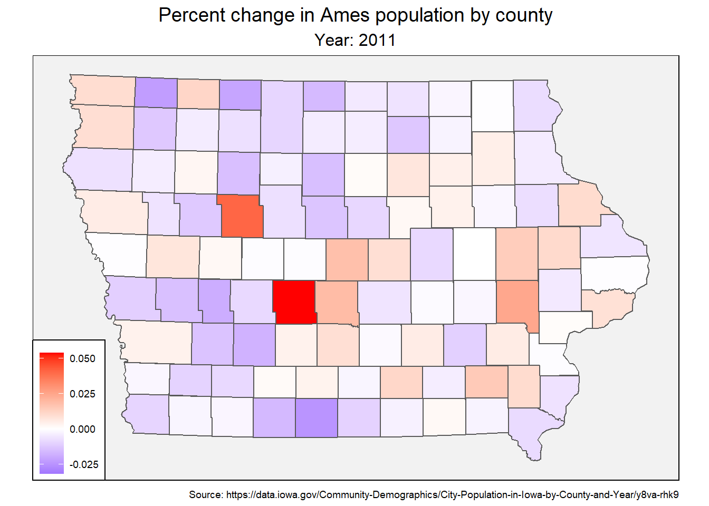

class: middle

```{r include=FALSE}
knitr::opts_chunk$set(fig.align="center",
                      fig.height = 5)
```


# Today's goal: 
- Reproduce this animation:

.center[

]

---
# Along the way, we'll:

- Learn some basics about shapefiles
- Work with some open data from `data.iowa.gov` and `geodata.iowa.gov`
- Use simple features with `ggplot2`
- Do a basic animation

---
# About me

- Bioinformatics PhD student in Adina Howe's lab
- Background in math and computer science
- Previous project was [MetaFunPrimer](https://github.com/pommevilla/MetaFunPrimer), a primer design pipeline for high-throughput qPCR.
- Current research is on the impact of human activity on biodiversity and environmental multifunctionality.
- Interested in machine learning, statistical modeling, Python, R, data visualization, reproducible research, and vim
---
class: inverse, center, middle

# Getting started

---
# Clone the repo:

```{r, eval=FALSE}
git clone https://github.com/pommevilla/lunchinatoR.git
```


# Install the packages we'll use today

- `tidyverse`: data manipulation and visualization
- `sf`: working with shapefiles
- `gganimate`: animations
- `ggthemes`: we'll use `theme_map()`  
- `geofacet`: some bonus visualizations 

---

# Reading in a simple feature

```{r, warning=FALSE, message=FALSE, results='hide'}
library(sf)

iowa.sf <- st_read('data/iowa_county_shapes') 
```

.footnote[Source: https://geodata.iowa.gov/dataset/county-boundaries-iowa]
---

# What's in an `sf` object?

```{r}
iowa.sf
```


---

# What's in an `sf` object?

- An `sf` object is basically a data frame with a `geometry` column describing where the object is located on Earth.


```{r}
class(iowa.sf)
```

- Since it inherits from the `data.frame` class, you can do all the things you're used to with an `sf` object
- `ggplot` has support for plotting simple features via `geom_sf`.

.footnote[For a more in-depth walkthrough of the simple feature class, refer to [`sf` vignette](https://cran.r-project.org/web/packages/sf/vignettes/sf1.html)]
---
class: middle

### Use `ggplot::geom_sf` to plot shapefiles

```{r, warning=FALSE, message=FALSE, results='hide'}
library(tidyverse)

iowa.sf %>% 
  ggplot() + 
  geom_sf() 
```
---

### `ggplot` and `dplyr` things work with `sf` objects

```{r fig.align="center"}
iowa.sf %>% 
  ggplot() + 
  geom_sf(aes(fill = ACRES))
```

---

### `ggplot` and `dplyr` things work with `sf` objects

```{r fig.align="center"}
iowa.sf %>% 
  filter(COUNTY == "Lee") %>% #<<
  ggplot() + 
  geom_sf(aes(fill = ACRES))
```

---

### `ggplot` and `dplyr` things work with `sf` objects

```{r}
iowa.sf %>% 
  filter(ACRES < 340000) %>% #<<
  ggplot() + 
  geom_sf(aes(fill = ACRES)) 
```


---

### Let's make it look nicer

```{r}
theme_set(ggthemes::theme_map()) #<<

iowa.sf %>% 
  ggplot() + 
  geom_sf(aes(fill = ACRES))
```

---

```{r}
iowa.sf %>% 
  ggplot() + 
  geom_sf(aes(fill = ACRES)) +
  labs(title = "Iowa Counties", #<<
       subtitle = "Filled by area")  #<< 
```

---

```{r}
iowa.sf %>% 
  ggplot() + 
  geom_sf(aes(fill = ACRES)) +
  labs(title = "Iowa Counties", 
       subtitle = "Filled by area") +
  theme(plot.title = element_text(hjust = 0.5), #<<
        plot.subtitle = element_text(hjust = 0.5), #<<
        legend.position = "none") #<<
```

---


```{r}
iowa.sf %>% 
  ggplot() + 
  geom_sf(aes(fill = ACRES)) + 
  labs(title = "Iowa Counties",
       subtitle = "Filled by area",
       caption = "Source: https://geodata.iowa.gov/dataset/county-boundaries-iowa") +  #<<
  theme(plot.title = element_text(hjust = 0.5),
        plot.subtitle = element_text(hjust = 0.5),
        legend.position = "none") + 
  geom_sf_text(aes(label = COUNTY), size = 2.25) #<<
```

---
class: inverse, center, middle

# Plotting multiple `sf` objects together

---
### Let's work with another `sf` object:

```{r warning=FALSE, message=FALSE, results='hide'}
iowa.districts <- 
  st_read('data/iowa_congressional_districts')
```


```{r warning=FALSE, message=FALSE, results='hide'}
iowa.districts
```


.footnote[Source: http://cdmaps.polisci.ucla.edu]
---

### Let's see what the districts look like

```{r}
iowa.districts %>% 
  ggplot() +
  geom_sf()
```

---

```{r}
iowa.districts %>% 
  ggplot() +
  geom_sf(color = "red", fill = "white" ) + #<<
  labs(title = "Iowa Congressional Districts") + #<<
  theme(plot.title = element_text(hjust = 0.5)) #<<
```

---

### To plot multiple `sf` objects together, call `geom_sf` again and specify the new `sf` object:

```{r, eval=FALSE}
iowa.sf %>% #<<
  ggplot() + 
  geom_sf(fill = "white") + 
  labs(title = "Iowa Counties") +  
  theme(plot.title = element_text(hjust = 0.5)) +
  geom_sf_text(aes(label = COUNTY), size = 2.25) + # inherits iowa.sf
  geom_sf(data = iowa.districts, color = "red") #<<
```


---

### Be careful when plotting multiple `sf` objects together...

```{r}
iowa.sf %>% 
  ggplot() + 
  geom_sf(fill = "white") + 
  labs(title = "Iowa Counties") +  
  theme(plot.title = element_text(hjust = 0.5)) +
  geom_sf_text(aes(label = COUNTY), size = 2.25) + 
  geom_sf(data = iowa.districts, color = "red") 
```

---

### Be careful when plotting multiple `sf` objects together...

```{r}
iowa.sf %>% 
  ggplot() + 
  geom_sf(fill = "white") + 
  labs(title = "Iowa Counties") +  
  theme(plot.title = element_text(hjust = 0.5)) +
  geom_sf_text(aes(label = COUNTY), size = 2.25) + 
  geom_sf(data = iowa.districts, color = "red", fill = NA) #<< 
```


---

* When we read in `iowa.districts`, we got a warning message that said "automatically selected the first layer in a data source containing more than one."
* This is because the `iowa_congressional_districts` folder contains more than one set of geometry information. 
* You can access these with the `layer` argument of `st_read`:

```{r warning=FALSE, message=FALSE, results='hide'}
iowa.house_districts <-  
  st_read('data/iowa_congressional_districts',
          layer = "IA_House_2013")
```
<br><br>
Try plotting the other two geometries present in the `iowa_congressional_districts` folder.

---
class: inverse, center, middle

# Converting coordinates to `sf` objects

---

### We can add points by latitude and longitude, but...

```{r}
sampling_site_coords <- 
  read.csv("./data/sampling_site_coordinates.csv")
```


```{r, error=TRUE}
iowa.sf %>% 
  ggplot() + 
  geom_sf(fill = "white") + 
  geom_sf(data = sampling_site_coords) #<<
```

---

### Use `st_as_sf` to convert lat/long coordinates to an `sf` object

```{r}
sampling_site_coords <- sampling_site_coords %>% 
  st_as_sf(coords = c("site_longitude", "site_latitude"), 
           crs = 4269) 

head(sampling_site_coords)
```


---

.footnote[See https://epsg.io/ for more information about coordinate reference systems. In general, mapping the coordinates to the same CRS as the shape object you're using will work out fine.]

---

### Now we're ready to plot

```{r, error=TRUE}
iowa.sf %>% 
  ggplot() + 
  geom_sf(fill = "white") + 
  labs(title = "DNR Sampling Site Locations") +  
  theme(plot.title = element_text(hjust = 0.5)) +
  geom_sf(data = sampling_site_coords, color = "red") 
```

---
class: inverse, center, middle

# Preparing county population data

---

```{r}
iowa.county_pops <- read.csv('data/iowa_county_pops.csv')

head(iowa.county_pops)
```


.footnote[Source: https://data.iowa.gov/]
---

### Data prep

- Extract year from `Year` column
- Convert year to integer
- Rename O'Brien county to match the `iowa.sf` object.


```{r, eval=FALSE}
iowa.county_pops <- iowa.county_pops %>% 
  separate('Year', 
           c(NA, NA, 'Year'), 
           sep = ' ') %>% 
  mutate(County = replace(County,
                     County == "O'Brien", "Obrien"),
         Year = as.integer(Year)) 

head(iowa.county_pops)
```

---

```{r, echo=FALSE}
iowa.county_pops <- iowa.county_pops %>% 
  separate('Year', 
           c(NA, NA, 'Year'), 
           sep = ' ') %>% 
  mutate(County = replace(County,
                     County == "O'Brien", "Obrien"),
         Year = as.integer(Year)) 

head(iowa.county_pops)
```

---

### Summarize year by year change 

```{r, message=FALSE, warning=FALSE}
iowa.county_pops.by_year <- iowa.county_pops %>% 
  group_by(County, Year) %>% 
  summarise(total_pop = sum(Estimate, na.rm = TRUE)) %>% 
  mutate(last_year_pop = lag(total_pop)) %>% 
  mutate(pct_change = (total_pop / last_year_pop - 1) * 100) %>% 
  ungroup() %>% 
  filter(Year > 2010)
```

---

Let's do a quick visualization:


```{r}
iowa.county_pops.by_year %>% 
  filter(Year > 2010,
         County %in% sample(unique(County), 20)) %>% 
  ggplot(aes(Year, pct_change)) +
  geom_point() +
  geom_line() +
  theme_bw() +
  facet_wrap(~ County)
```

---
class: inverse, center, middle

# Working towards an animation

---
### Let's combine our population data with the `iowa.sf` object:

```{r}
iowa.joined_sf <- 
  inner_join(iowa.sf, 
             iowa.county_pops.by_year, 
             by = c("COUNTY" = "County"))
```

**Sanity check**: How many rows does `iowa.joined_sf` have? How many should it have?

---
### Let's begin by plotting one year:

```{r}
iowa.joined_sf %>% 
  filter(Year == 2018) %>% 
  ggplot(aes(fill = pct_change)) + 
  geom_sf()
```

---

### Let's clean this up:

```{r eval=FALSE}
iowa.joined_sf %>% 
  filter(Year == 2018) %>% 
  ggplot(aes(fill = pct_change)) + 
  geom_sf() + 
  scale_fill_viridis_c(name = "% Change\nfrom prev. year") +
  labs(title = "Percentage change in Iowa county populations by year",
       subtitle = "Year: 2018") + 
  theme(plot.title = element_text(hjust = 0.5),
        plot.subtitle = element_text(hjust = 0.5),
        legend.background = element_rect(fill = NA)) + 
  geom_sf_text(aes(label = COUNTY), size = 2.5)
```

---
class: center, middle

```{r echo=FALSE}
iowa.joined_sf %>% 
  filter(Year == 2018) %>% 
  ggplot(aes(fill = pct_change)) + 
  geom_sf() + 
  scale_fill_viridis_c(name = "% Change\nfrom prev. year") +
  labs(title = "Percentage change in Iowa county populations by year",
       subtitle = "Year: 2018") + 
  theme(plot.title = element_text(hjust = 0.5),
        plot.subtitle = element_text(hjust = 0.5),
        legend.background = element_rect(fill = NA)) + 
  geom_sf_text(aes(label = COUNTY), size = 2.5)
```

---
### Now that we have our graph mostly how we want it, let's animate it

```{r, eval=FALSE}
library(gganimate)

iowa.joined_sf %>% 
  ggplot(aes(fill = pct_change)) + 
  geom_sf() + 
  scale_fill_viridis_c(name = "% Change\nfrom prev. year") +
  labs(title = "Percentage change in Iowa county populations by year",
       subtitle = "Year: { current_frame }") +  #<<
  theme(plot.title = element_text(hjust = 0.5),
        plot.subtitle = element_text(hjust = 0.5),
        legend.background = element_rect(fill = NA),
        legend.position = "right") + 
  geom_sf_text(aes(label = COUNTY), size = 2.5) + 
  transition_manual(Year) #<<
```


---
class: center, middle

```{r, echo=FALSE}
library(gganimate)

iowa.joined_sf %>% 
  ggplot(aes(fill = pct_change)) + 
  geom_sf() + 
  scale_fill_viridis_c(name = "% Change\nfrom prev. year") +
  labs(title = "Percentage change in Iowa county populations by year",
       subtitle = "Year: { current_frame }") +  #<<
  theme(plot.title = element_text(hjust = 0.5),
        plot.subtitle = element_text(hjust = 0.5),
        legend.background = element_rect(fill = NA),
        legend.position = "right") + 
  geom_sf_text(aes(label = COUNTY), size = 2.5) + 
  transition_manual(Year) #<<
```


---
class: inverse, center, middle

# Bonus: `geofacet`

---

### The `geofacet` package makes it easy to make complex maps with the US map

As an example, let's plot the change in state population over the past few years on the US map.

---

### The data:
```{r  warning=FALSE, message=FALSE, results='hide'}
state_pops <- read.csv("data/us_state_pops.csv", check.names = FALSE) %>% 
  as_tibble() 

state_pops_long <- state_pops %>% 
  pivot_longer(cols = `2010`:`2019`, names_to = "year", values_to = "pop") %>% 
  mutate(year = as.integer(year)) %>% 
  group_by(state) %>% 
  mutate(pct_change = (pop / lag(pop) - 1) * 100) %>%
  ungroup() %>% 
  filter(year > 2010)

head(state_pops_long)
```

.footnote[Source: https://www.census.gov/data/datasets/time-series/demo/popest/2010s-state-total.html]

---

### A quick visualization:

```{r, eval=FALSE}
state_pops_long %>% 
  filter(state != sample(unique(state), 1)) %>% # to make faceting nicer
  ggplot(aes(year, pct_change, color = state)) + 
  geom_point() + 
  geom_line() +
  labs(x = "",
       y = "",
       title = "Yearly percent change in population by state from 2010 to 2019",
       caption = "Source: U.S. Census Bureau, Population Division") +
  facet_wrap(~ state, ncol = 10) +
  scale_x_continuous(breaks = seq(2011, 2019, 2), expand = c(0, 0)) +
  scale_y_continuous(labels = function (x) paste0(x, "%")) + 
  theme_bw() +
  geom_hline(yintercept = 0, alpha = 0.5, linetype = "dashed") + 
  theme(legend.position = "none",
        plot.title = element_text(hjust = 0.5),
        axis.text.x = element_blank(),
        axis.ticks.x = element_blank() ) 
```


---
class: center, middle

```{r, echo=FALSE}
state_pops_long %>% 
  filter(state != sample(unique(state), 1)) %>% # to make faceting nicer
  ggplot(aes(year, pct_change, color = state)) + 
  geom_point() + 
  geom_line() +
  labs(x = "",
       y = "",
       title = "Yearly percent change in population by state from 2010 to 2019",
       caption = "Source: U.S. Census Bureau, Population Division") +
  facet_wrap(~ state, ncol = 10) +
  scale_x_continuous(breaks = seq(2011, 2019, 2), expand = c(0, 0)) +
  scale_y_continuous(labels = function (x) paste0(x, "%")) + 
  theme_bw() +
  geom_hline(yintercept = 0, alpha = 0.5, linetype = "dashed") + 
  theme(legend.position = "none",
        plot.title = element_text(hjust = 0.5),
        axis.text.x = element_blank(),
        axis.ticks.x = element_blank() ) 
```


---

`geofacet::facet_geo` maps each of the plots onto the states:

```{r, eval=FALSE}
library(geofacet)

state_pops_long %>% 
  ggplot(aes(year, pct_change, color = state)) + 
  geom_point() + 
  geom_line() +
  labs(x = "",
       y = "",
       title = "Yearly percent change in population by state") +
  facet_geo(~ state) + #<<
  scale_x_continuous(breaks = seq(2011, 2019, 2)) +
  theme_minimal() + 
  geom_hline(yintercept = 0, alpha = 0.5, linetype = "dashed") + 
  theme(legend.position = "none",
        plot.title = element_text(hjust = 0.5),
        axis.text.x = element_blank(),
        axis.text.y = element_blank(),
        axis.ticks = element_blank()) 
```

---
class: center, middle

```{r, echo=FALSE}
library(geofacet)

state_pops_long %>% 
  ggplot(aes(year, pct_change, color = state)) + 
  geom_point() + 
  geom_line() +
  labs(x = "",
       y = "",
       title = "Yearly percent change in population by state") +
  facet_geo(~ state) + #<<
  scale_x_continuous(breaks = seq(2011, 2019, 2)) +
  theme_minimal() + 
  geom_hline(yintercept = 0, alpha = 0.5, linetype = "dashed") + 
  theme(legend.position = "none",
        plot.title = element_text(hjust = 0.5),
        axis.text.x = element_blank(),
        axis.text.y = element_blank(),
        axis.ticks = element_blank()) 
```

---

# Thanks for your time! Have a nice day!

- Email me at pev@iastate.edu if you want to talk about coding, visualizations, Vim, or Teamfight Tactics :)